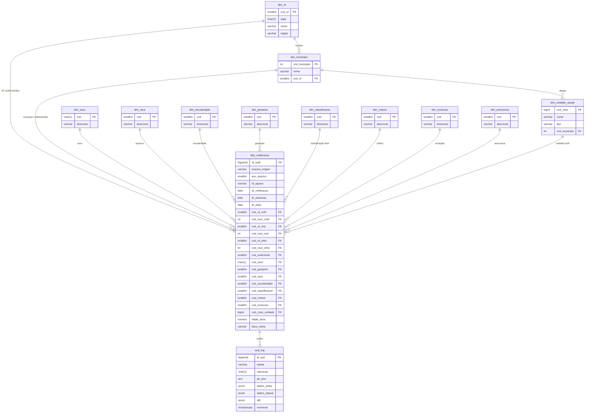

# Diagrama Entidade-Relacionamento — Base Zika BR

Modelo em estrela com a tabela `fato_notificacao` no centro, dimensões geográficas
(UF, município), categóricas (sexo, raça, escolaridade, gestante, classificação,
critério, evolução, autoctonia) e a tabela `aud_log` de auditoria transversal.

## Convenções

- **PK = Primary Key**, **FK = Foreign Key**.
- Toda dimensão categórica usa um código (`cod`) curto e uma `descricao` textual.
- A `fato_notificacao` se relaciona **três vezes** com `dim_uf` e três vezes com
  `dim_municipio`, refletindo notificação, residência e local provável de infecção
  — uma distinção crítica do SINAN.
- `aud_log` é uma tabela transversal, alimentada por triggers em todas as tabelas
  críticas. O snapshot anterior e posterior é armazenado em `JSONB`.

## Cardinalidades

| Relação | Cardinalidade |
|---|---|
| `dim_uf` → `dim_municipio` | 1 : N |
| `dim_uf` → `fato_notificacao` | 1 : N (×3: notif / resi / infec) |
| `dim_municipio` → `fato_notificacao` | 1 : N (×3) |
| Dimensões categóricas → `fato_notificacao` | 1 : N |
| `fato_notificacao` → `aud_log` | 1 : N (uma linha por DML) |
